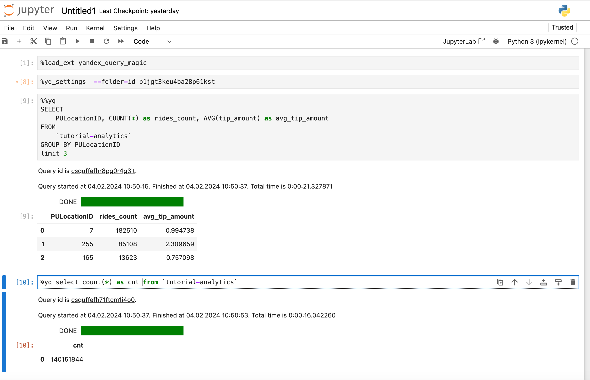

# yandex_query_magic

Yandex Query cell (%%yq) and line (%yq) magics for Jupyter and VSCode



## Motivation

yandex_query_magic was created to:

1. Yandex Query magics for Jupyter Notebook simplify the process of writing and executing queries directly within notebooks, enhancing productivity and interactive data exploration.
2. They enable seamless integration with Yandex Query services, allowing users to effortlessly access and analyze large datasets hosted on Yandex’s cloud platform without leaving the Jupyter environment.
3. By providing shortcuts for common operations and queries, these magics reduce the necessity for boilerplate code, making data analysis workflows more efficient and user-friendly.


## Quick Start

Install pip package:
```
%pip install yandex_query_magic --upgrade --quiet
```

Enable jupyter extension for UI controls in Jupyter Notebooks:
```
%jupyter contrib nbextension install --user
```

Run extension in Jupyter Notebook:
```
%load_ext yandex_query_magic
%yq_settings --folder-id b1ggt6geu4aa38p61kst
%yq select 1
```

## Usage

### Global settings
Example:
```%yq_settings --folder-id b1ggt6geu4aa38p61kst```


Parameters:
- `--folder-id <folder_id>`: **Required**. Default folder to execute Yandex Query queries.
- `--vm-auth`: **Default mode**. If set sets authentication mode to VM account key. See [more](https://cloud.yandex.com/en/docs/serverless-containers/operations/sa).
- `--sa-file-auth <sa_key.json>`: If set sets authentication mode to authorized keys. See [more](https://cloud.yandex.com/en/docs/iam/operations/authorized-key/create).

## Usage Details

### Basic usage

```sql
%yq select 1
```

Here `%yq` is the magic's name and ```select 1``` is the query text.

### Advanced usage

```sql
%yq --folder-id b1ggt6geu4aa38p61kst --name "My query" --description "Test query" --raw-results

select col1, count(*) from table group by col1
```

Parameters:
- `--folder-id <folder_id>`: folder to execute Yandex Query the query.
- `--name "<name>"`: query name.
- `--description "<description>"`: query description.
- `--raw-results`: returns raw unconverted results from Yandex Query. Specification can be found [here](https://cloud.yandex.com/en/docs/query/api/yql-json-conversion-rules).

### Variables expansion

yandex_query_magics support several ways of variables expansion.

#### Jinja2 templates

```sql
%yq <other parameters> --jinja2

select * from table where col1 like "{{val}}"
```

Parameters:
- `--jinja2`: turns on rendering query text with [Jinja](https://jinja.palletsprojects.com/en/3.0.x/templates/) templates. Requires `Jinja2` package to be installed.

#### Capture DataFrame variable from Jupyter

yandex_query_magic can capture variables specified in query in mustache syntax.

Suppose, you have a DataFrame:
```python
df = pd.DataFrame({'_float': [1.0],
                            '_int': [1],
                            '_datetime': [pd.Timestamp('20180310')],
                            '_string': ['foo']})
```

Then `df` can be used as variable in YQ queries. While running DataFrame is created like table with DataFrame structure and named like a variable, `df` in current example.

```sql
%%yq
select * from mytable inner join {{df}} on mytable.id=df._int
```

Currently supported Dataframe types:
- int64
- float64
- datetime64[ns]
- string

If you do not want to use variable expansion functionality, it can be disable using `--no-var-expansion` parameter, like this:

```sql
%%yq --no-var-expansion
select * from mytable inner join {{df}} on mytable.id=df._int
```

#### Capture Dict variable from Jupyter

yandex_query_magic can capture variables specified in query in mustache syntax.

Suppose, you have a Dict:
```python
dct = {"a": 1, "b": 2.0, "c": "test", "d": datetime(2022, 2, 2, 21, 12, 12)}
```

Then `dct` can be used as variable in YQ queries.
It will be transformed to single row table of structure:

|a|b|c|d|
|--|--|--|--|
|1|2.0|"test"|DateTime("2022-02-02 21:12:12")|

Dict `dct` can be used in queries named as variable, `dct`.

```sql
%%yq
select * from mytable inner join {{dct}} on mytable.id=dct.a
```

Currently supported types:
- int
- float
- datetime
- string

#### Capture List variable from Jupyter

yandex_query_magic can capture variables specified in query in mustache syntax.

Suppose, you have a List:
```
lst = [1,2,3]
```

Then `lst` can be used as variable in YQ queries. While running List is created and named like a variable, `lst` in current example.


```sql
%%yq
select * from mytable where mytable.id in {{lst}}
```

Currently supported types:
- int
- float
- datetime
- string

## Capturing output

Line Magics can be captured with assignment:

```
# These are equivalent:
varname = %yq <query>
```

Cell magics can be captured specifying variable name at query text start with `<<` operator

```sql
%%yq
varname <<  <query>
```

To silence a cell, you can stack %%capture:

```
%%capture
%%yq
<query>
```
